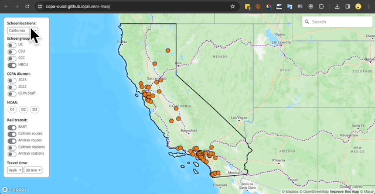

# ccpa-alumni-map

What colleges and universities have CCPA graduates chosen to attend? Use this interactive map to explore the college journeys of CCPA alumni.

- See it live: https://ccpa-ousd.github.io/alumni-map

## About CCPA

Coliseum College Preparatory Academy (CCPA) is a small public secondary school in Oakland Unified School District (OUSD) serving grades 6-12 on the Havenscourt campus in East Oakland. Our unique 7-year program offers stability and supports students to meet the requirements for college admission. Our graduates go to UCs, CSUs, and private universities.

CCPA invests in teachers and family relationships to meet learners' unique needs and support their development into thinkers, communicators, and powerful community members. We strive to value their passions and interests and connect their learning to the real world. We require students to demonstrate what they know and are able to do.

[School Rankings (2022)](https://bit.ly/CCPA2022STATS):

- No. 2,134 in National Rankings
- No. 306 in California High Schools
- No. 54 in San Francisco, CA Metro Area High Schools
- No. 1 in OUSD High Schools

## Maintenance

For people and school map markers, you can edit the data in Google Sheets to modify the location of markers (longitude, latitude coordinates), and the information which appears on popups. You can edit which map markers appear (circles, icons, etc.) in the JavaScript code within `index.html`.

### Reminders

- **Data privacy:** Get permission from students (or parents/guardians) before publishing student data (like photos or names) on the Internet.
- **Identity affirmation:** Remember to use students' preferred names (and pronouns where applicable) as a practice of identity affirmation.

### Add a new class

1. Contact graduates to request their permission to publish their slides and decision day information. Send this release form and save signed, returned copies in a folder ignored by Git.
1. Open the "Decision Day" slide deck and edit slides to remove any information you don't want to publish.
2. Download the slide deck as a PDF file. 

## Data sources

### Alumni

Alumni data comes from student slides submitted for Decision Day at CCPA.

### Staff

Staff data is scraped from

### Transit layers

For transit layers (BART, Caltrain, etc.) the geometries (points or lines) and metadata are fixed within the data sources from the original providers, and can be replaced – but not modified:

- [BART](https://www.bart.gov/) [stations and lines](https://www.bart.gov/schedules/developers/geo) geometries are from BART.gov
- [Caltrain](https://www.caltrain.com/) [routes](https://data.smcgov.org/Transportation/Caltrain-Routes/upph-wy44) and [stops](https://data.smcgov.org/Transportation/Caltrain-Stations-and-Stops/jzd3-rqcd) geometries are from Open San Mateo County
- [Amtrak](https://www.amtrak.com/) [stations](https://hub.arcgis.com/datasets/fedmaps::amtrak-rail-stations/explore) and [routes](https://data-usdot.opendata.arcgis.com/datasets/baa5a6c4d4ae4034850e99aaca38cfbb_0/about) are from Esri U.S. Federal Datasets and National Transportation Atlas Database (NTAD).

The tilesets for are

## Technology stack

- [Mapbox GL JS](https://docs.mapbox.com/mapbox-gl-js/guides/) JavaScript library
- [Google Sheets](https://www.google.com/sheets/about/) application for data management
- [Mapbox csv2geojson](https://github.com/mapbox/csv2geojson) utility for converting CSV to GeoJSON
- [Mapbox GL Geocoder](https://github.com/mapbox/mapbox-gl-geocoder) map control for search
- [Mapbox Isochrone API](https://docs.mapbox.com/api/navigation/isochrone/) for travel time estimates
- [Mapbox Studio](https://studio.mapbox.com/) for tileset production and map styling
- [Mapbox Assembly](https://github.com/mapbox/assembly/) CSS framework
- JavaScript / HTML / CSS

## About the creator

[Dom Brassey](https://linkedin.com/in/dombrassey) (she/they) ("Mx. Brassey") teaches computer science at [Coliseum College Prep Academy](https://www.ousd.org/ccpa). CCPA is a public school serving students (grades 6-12) in the eastern region of the Oakland Unified School District in Oakland, California, USA.
